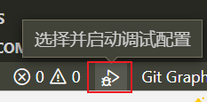
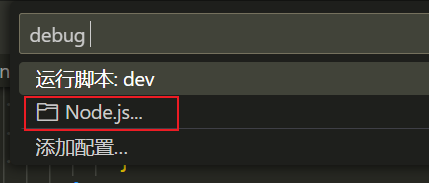
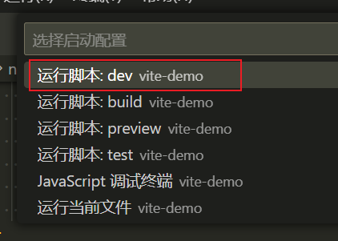
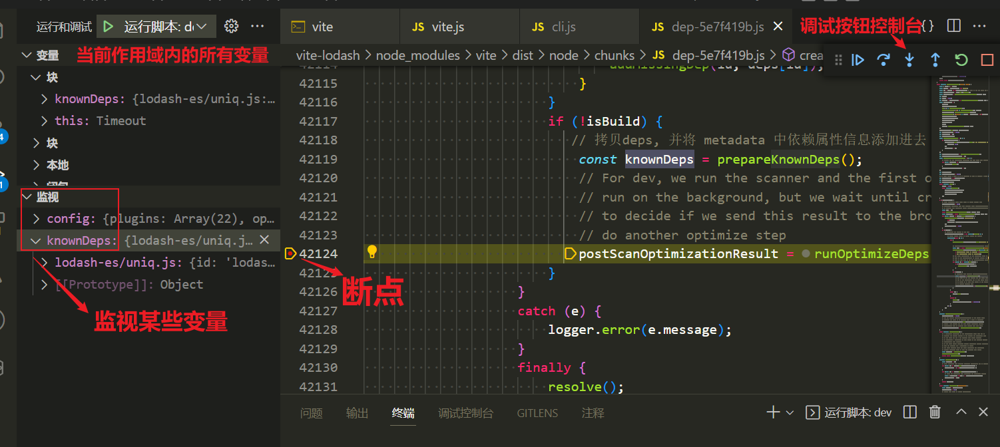

# Vite 依赖预构建源码浅析

文章地址：https://juejin.cn/post/7193355148737904696

## 项目目录介绍

仓库中有两个项目，一个是普通项目：normal-lodash，另一个是 Vite 搭建的项目：vite-lodash。
其中，normal-lodash 需要 `npm i` 安装一下依赖，而 vite-lodash 的 node_modules 我一并上传进去了，无需再安装，因为我在其中一部分 vite 文件中做了注释（想删掉重新也行）。

## 项目调试

normal-lodash 直接使用 VS Code 扩展 `Live Server` 即可。

vite-lodash 直接 `npm run dev` 即可。

### vite 的断点调试

1. `npm run dev` 命令会经 `node_modules/.bin/vite` 到 `node_modules/vite/bin/vite.js` 最终抵达 `/node_modules/vite/dist/node/cli.js`；

2. 在 `cli.js` 中，找到这么一段开头：

    ```js
    // dev
    cli
        .command('[root]', 'start dev server') // default command
    // ......略
    const { createServer } = await import('./chunks/dep-5e7f419b.js').then(function (n) { return n.F; });
    ```
    
    这里就是执行 `npm run dev` 的逻辑，所以点开后面 import 引入的文件，搜索 `createServer`，就能最终找到 vite 创建 DevServer 开始的地方了。
    
    ```js
    // vite-lodash/node_modules/vite/dist/node/chunks/dep-5e7f419b.js
    
    async function createServer(inlineConfig = {}) {
        // ......
    }
    ```
    
3. VS Code 断点调试

    - 在 VSCode 中，按<kbd>F5</kbd>键，或者查看左下角有没有这种 Debug 小图标：


    

    - 一开始没有命令的，可以选择 `NodeJS` 进行添加，VS Code 会自动读取 `package.json` 中的 `scripts` 命令

      

    - 点击其中一个执行，就可以了

      

    - 现在就可以在文件中打断点了，并且在左侧边栏中监视变量：

      
